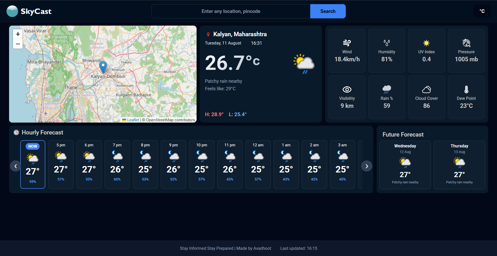

# 🌦️ SkyCast — Weather Application

<p align="center">
  <strong>A modern, responsive weather application built with Vanilla JavaScript and WeatherAPI.</strong>
</p>

<p align="center">
  Search locations, view current weather conditions, explore hourly forecasts, check upcoming weather, and view the selected location on an interactive map.
</p>

<p align="center">
  
  
  
  
  
  
</p>

---

## 📸 Preview

<p align="center">
  
</p>

---

## 🚀 Live Demo

**SkyCast:** https://skycast-avdhoot25.vercel.app/

---

## 📌 Overview

SkyCast is a web-based weather application that retrieves weather information from **WeatherAPI** and presents it through a responsive dashboard.

The application combines current weather conditions, detailed weather metrics, hourly forecasts, future forecasts, and an interactive map in a single interface.

The project is built with **HTML, CSS, and Vanilla JavaScript (ES6+)**.

---

## ✨ Features

### 🌡️ Current Weather
- Current temperature
- Weather condition
- Dynamic weather icon
- Feels-like temperature
- Today's high and low temperature
- Current date and time
- Selected location

### 📊 Weather Metrics
- Wind speed
- Humidity
- UV Index
- Atmospheric pressure
- Visibility
- Rain probability
- Cloud cover
- Dew point

### 🕐 Hourly Forecast
- Current weather
- Upcoming hourly temperatures
- Weather conditions
- Dynamic weather icons
- Precipitation probability
- Horizontally scrollable forecast cards

### 📅 Future Forecast
- Multi-day forecast
- Daily temperature
- Weather condition
- Dynamic weather icons
- Precipitation information

### 🗺️ Interactive Map
- Selected location displayed on a map
- Zoom controls
- Location marker
- Leaflet map rendering
- OpenStreetMap map tiles

### 🔎 Location Search
- Search by location
- Search by pincode where supported by WeatherAPI
- Weather data updates based on the searched location

### ⚙️ User Interface
- Responsive dashboard
- Dark weather-dashboard design
- Loading state during API requests
- Error handling
- Dynamic DOM updates
- Celsius temperature display

---

## 🛠️ Tech Stack

| Technology | Purpose |
|---|---|
| **HTML5** | Application structure |
| **CSS3** | Styling, layout and responsive design |
| **JavaScript ES6+** | Application logic and API integration |
| **WeatherAPI** | Weather and forecast data |
| **Leaflet** | Interactive maps |
| **OpenStreetMap** | Map tile data |
| **Git & GitHub** | Version control |
| **Vercel** | Deployment |

---

## 🔗 APIs, Libraries & External Dependencies

### WeatherAPI

WeatherAPI provides the weather and forecast data used by SkyCast.

The application uses weather information such as:

- Current conditions
- Temperature
- Feels-like temperature
- Wind
- Humidity
- Visibility
- UV index
- Cloud cover
- Forecast
- Astronomy information
- Location information

Website: https://www.weatherapi.com/

### Leaflet

Leaflet is used to display and control the interactive map.

Website: https://leafletjs.com/

### OpenStreetMap

OpenStreetMap provides the map data displayed through Leaflet.

Website: https://www.openstreetmap.org/

---

## 🔐 API Key & Environment Variables

SkyCast requires a WeatherAPI API key.

The API key should **not** be committed directly to GitHub.

If the project uses an environment variable, configure it as:

```env
WEATHER_API_KEY=your_api_key_here
```

For Vercel deployment, configure the variable in the project's Vercel environment settings.

> Use the exact environment variable name required by your current application code. If your code currently uses a different name, keep that name instead of changing it only for the README.

---

## 📦 Running the Project Locally

### Prerequisites

Install:

- Git
- Node.js
- A modern web browser
- A WeatherAPI account and API key
- Vercel CLI if using `vercel dev`

### 1. Clone the repository

```bash
git clone https://github.com/avadhoot-dev/weather-app.git
cd weather-app
```

### 2. Configure your API key

Set the WeatherAPI key using the environment-variable method used by the project.

Example:

```env
WEATHER_API_KEY=your_api_key_here
```

### 3. Start the local development server

If using Vercel CLI:

```bash
vercel dev
```

Open:

```text
http://localhost:3000
```

---

## 🧠 Application Flow

```text
User
 │
 │ searches for a location
 ▼
JavaScript
 │
 │ sends API request
 ▼
WeatherAPI
 │
 │ returns JSON
 ▼
Weather Data
 │
 │ processed by JavaScript
 ▼
DOM Updates
 │
 ├── Current Weather
 ├── Weather Metrics
 ├── Hourly Forecast
 ├── Future Forecast
 └── Interactive Map
```

---

## 📁 Repository Structure

Your repository currently contains an `old/` directory containing previous project files. The exact application filenames should be kept as they exist in your repository.

A typical structure is:

```text
weather-app/
│
├── old/
│
├── assets/
│   └── weather-app-preview.png
│
├── index.html
├── style.css
├── script.js
├── .gitignore
└── README.md
```

> Do not rename your existing files just to match this example. Update this section later if your final project structure differs.

---

## 🚢 Deployment

SkyCast is deployed using **Vercel** and connected to the GitHub repository.

Typical workflow:

```text
Local Development
       │
       ▼
   Git Commit
       │
       ▼
    Git Push
       │
       ▼
 GitHub Repository
       │
       ▼
 Vercel Deployment
       │
       ▼
 Production Website
```

Live application:

https://skycast-avdhoot25.vercel.app/

---

## 🔄 Current Data Behaviour

Weather data is fetched when the application loads and when a user searches for a location.

The current version does not continuously refresh weather data while the page remains open.

Automatic periodic weather refresh is planned as a future improvement.

---

## 🗺️ Map Attribution

SkyCast uses **Leaflet** for interactive map functionality and **OpenStreetMap** map data.

Map attribution is displayed within the map interface as required by the respective services.

---

## 🔮 Future Improvements

- [ ] Automatic weather data refresh
- [ ] Weather alerts
- [ ] Air Quality Index (AQI)
- [ ] AI-powered weather analysis
- [ ] Weather highlights and summaries
- [ ] Improved location detection
- [ ] Additional weather visualizations
- [ ] More detailed weather statistics
- [ ] Improved mobile experience
- [ ] User location detection

---

## 📚 What This Project Demonstrates

This project provides practical experience with:

- REST API integration
- HTTP requests
- `fetch()`
- Asynchronous JavaScript
- JSON data processing
- DOM manipulation
- Dynamic UI rendering
- Loading and error states
- Third-party JavaScript libraries
- Interactive maps
- API-driven frontend applications
- Environment variables
- Git and GitHub
- Vercel deployment

---

## 👨‍💻 Author

**Avadhoot**

GitHub: https://github.com/avadhoot-dev

